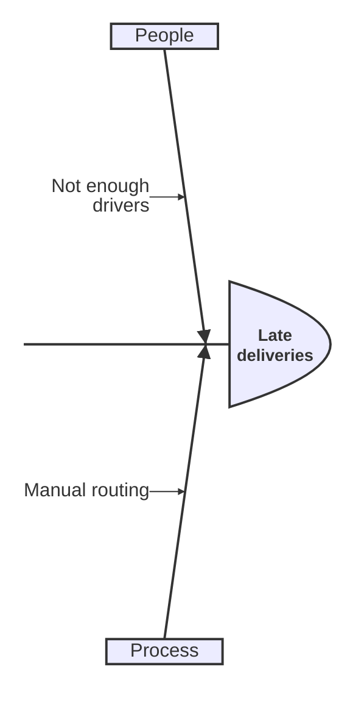

# Ishikawa / fishbone (beta)

```mermaid
ishikawa-beta
    Late deliveries
    People
        Not enough drivers
    Process
        Manual routing
```

The first line after the keyword is the effect (the problem). Indented lines below it
are cause categories, and lines indented further are causes within them.
