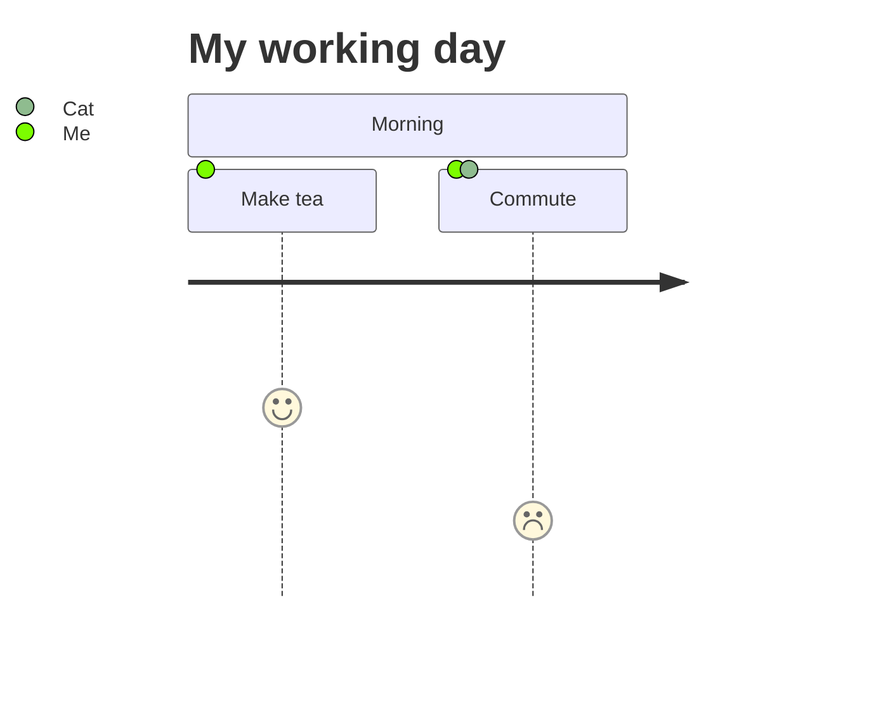

# User journey

```mermaid
journey
    title My working day
    section Morning
      Make tea: 5: Me
      Commute: 2: Me, Cat
```

Each task is `Task name: score: actors`, with a score from 1 (unhappy) to 5 (happy).
Group tasks with `section Name`.

Docs: <https://mermaid.js.org/syntax/userJourney.html>
