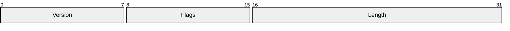

# Packet diagram

```mermaid
packet
    0-7: "Version"
    8-15: "Flags"
    16-31: "Length"
```

Each line is `start-end: "Label"` in bits. Newer syntax: `+8: "Field"` adds 8 bits after the previous field.

Docs: <https://mermaid.js.org/syntax/packet.html>
