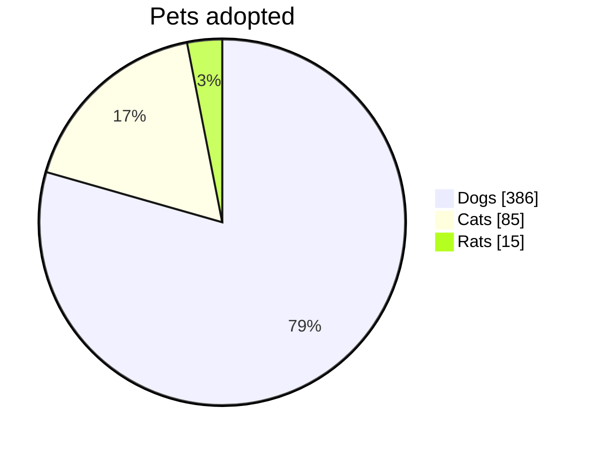

# Pie chart

```mermaid
pie showData
    title Pets adopted
    "Dogs" : 386
    "Cats" : 85
    "Rats" : 15
```

`showData` prints the values next to the legend. Values must be positive numbers.

Docs: <https://mermaid.js.org/syntax/pie.html>
