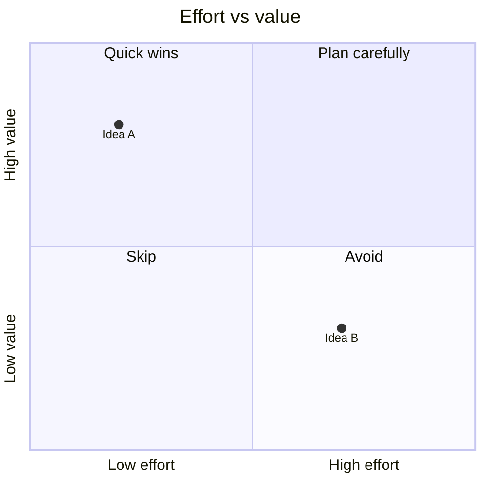

# Quadrant chart

```mermaid
quadrantChart
    title Effort vs value
    x-axis Low effort --> High effort
    y-axis Low value --> High value
    quadrant-1 Plan carefully
    quadrant-2 Quick wins
    quadrant-3 Skip
    quadrant-4 Avoid
    Idea A: [0.2, 0.8]
    Idea B: [0.7, 0.3]
```

Points are `Name: [x, y]` with x and y between 0 and 1.
Quadrants are numbered anticlockwise from the top right.

Docs: <https://mermaid.js.org/syntax/quadrantChart.html>
