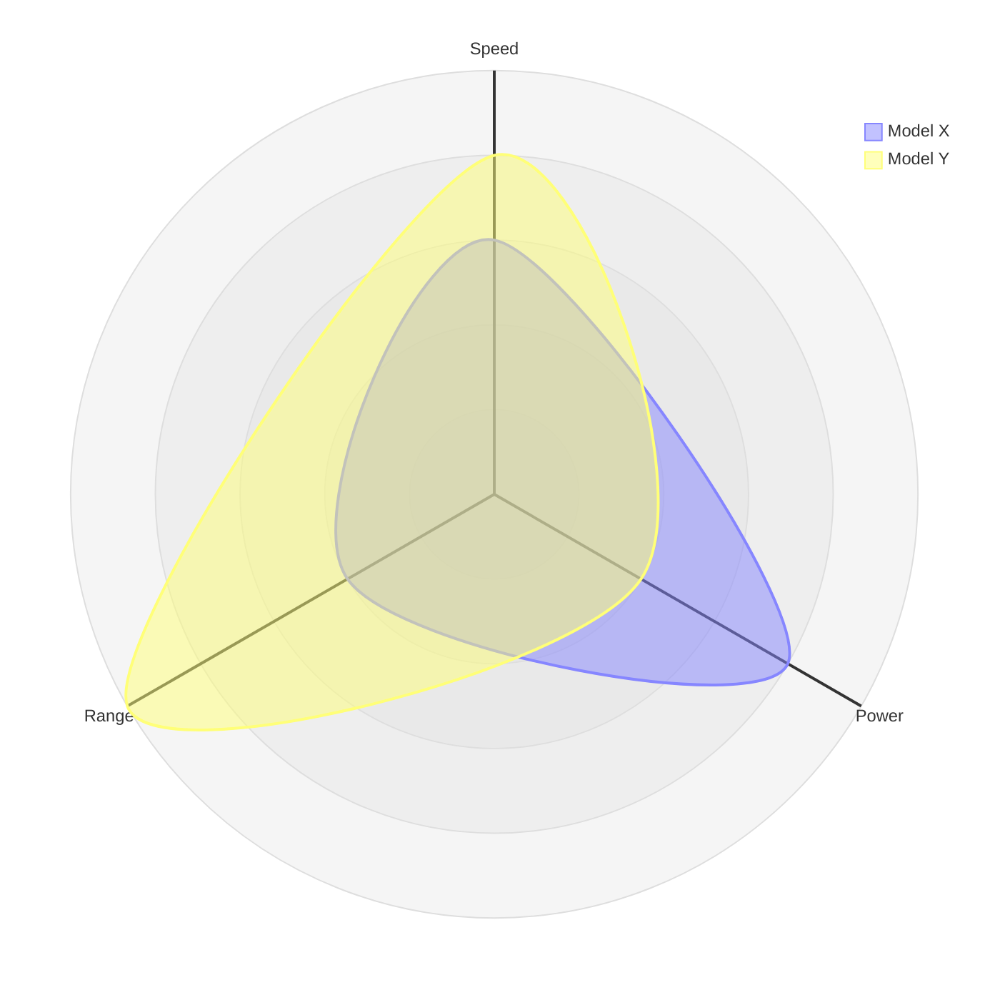

# Radar chart

```mermaid
radar-beta
    axis a["Speed"], b["Power"], c["Range"]
    curve x["Model X"]{3, 4, 2}
    curve y["Model Y"]{4, 2, 5}
    max 5
```

Options: `max`, `min`, `ticks 5`, `graticule polygon` (or `circle`), `showLegend false`.

Docs: <https://mermaid.js.org/syntax/radar.html>
