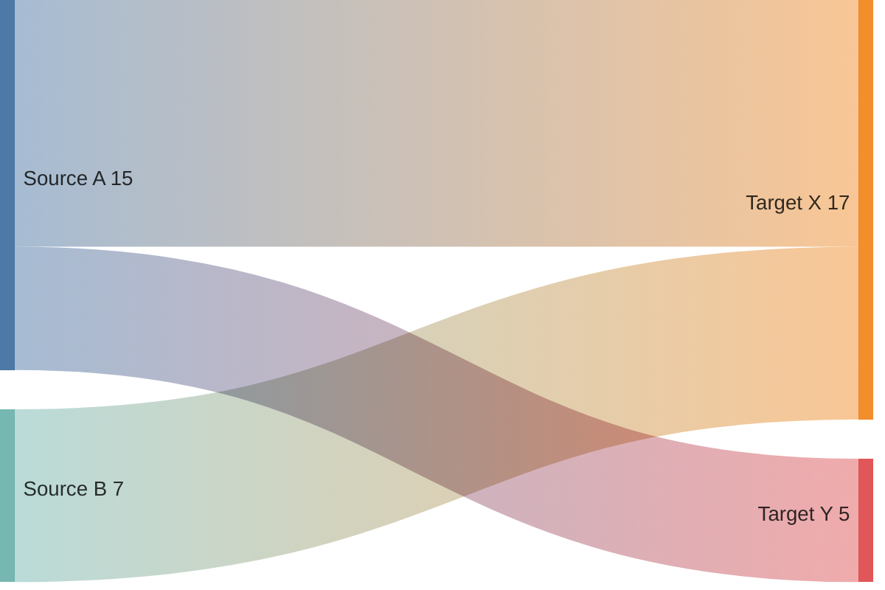

# Sankey diagram

```mermaid
sankey

Source A,Target X,10
Source A,Target Y,5
Source B,Target X,7
```

The body is CSV: `source,target,value`, one flow per line.
Quote names containing commas: `"Gas, imported",Homes,12`.

Docs: <https://mermaid.js.org/syntax/sankey.html>
