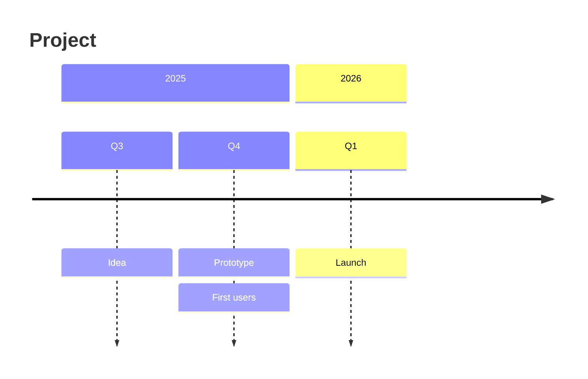

# Timeline

```mermaid
timeline
    title Project
    section 2025
        Q3 : Idea
        Q4 : Prototype : First users
    section 2026
        Q1 : Launch
```

Each line is `period : event [: event ...]`. Use `section` to group periods.

Docs: <https://mermaid.js.org/syntax/timeline.html>
