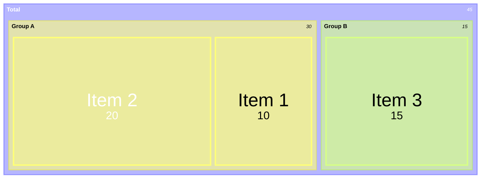

# Treemap

```mermaid
treemap
"Total"
    "Group A"
        "Item 1": 10
        "Item 2": 20
    "Group B"
        "Item 3": 15
```

Indentation sets the hierarchy. Leaves have `"Name": value`; parents are sized by their children.

Docs: <https://mermaid.js.org/syntax/treemap.html>
