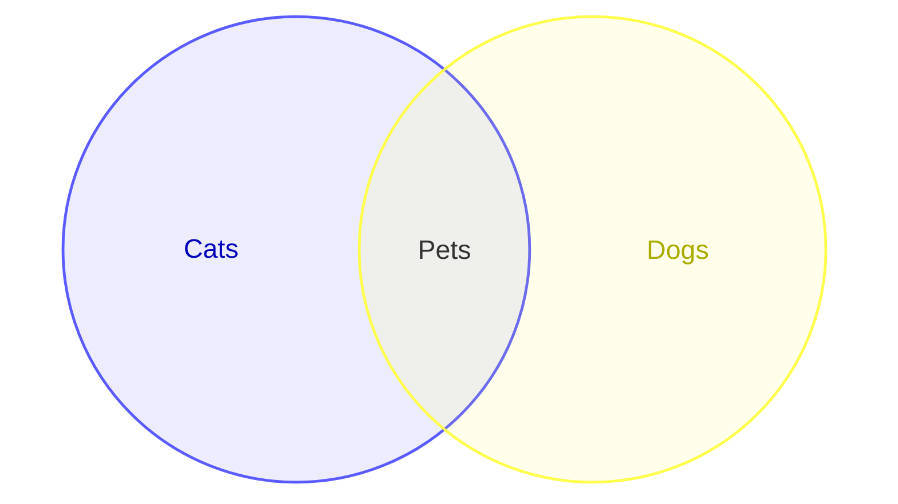

# Venn diagram (beta)

```mermaid
venn-beta
    set A["Cats"]
    set B["Dogs"]
    union A,B["Pets"]
```

Declare sets with `set ID["Label"]`, then overlaps with `union ID,ID["Label"]`.
Add `title` for a heading.
