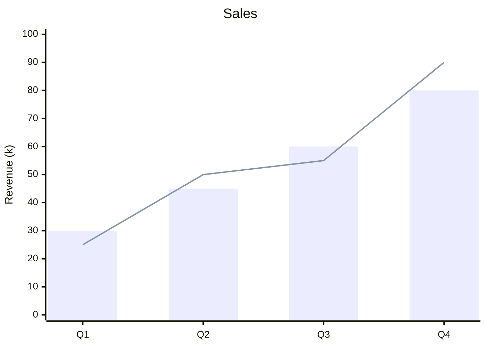

# XY chart

```mermaid
xychart
    title "Sales"
    x-axis [Q1, Q2, Q3, Q4]
    y-axis "Revenue (k)" 0 --> 100
    bar [30, 45, 60, 80]
    line [25, 50, 55, 90]
```

Add `horizontal` after `xychart` to flip the axes. A numeric x-axis is
`x-axis "Label" 0 --> 10`.

Docs: <https://mermaid.js.org/syntax/xyChart.html>
